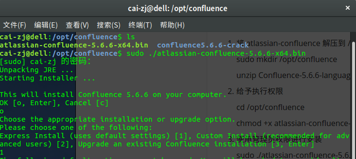
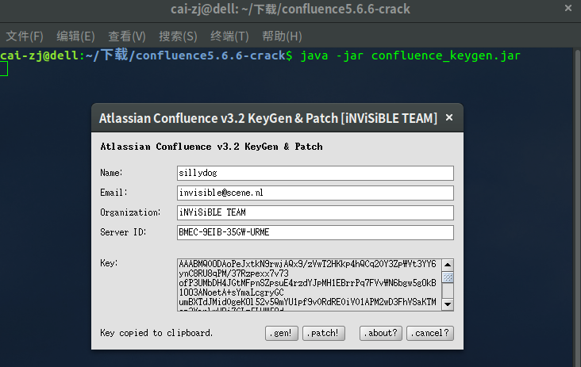
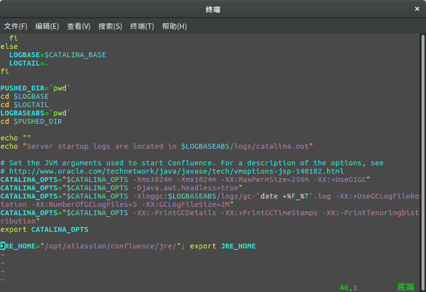
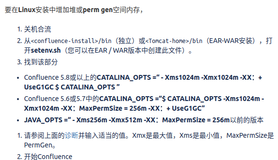

# Confluence-安装破解

## 一 .  环境配置

​	Java sdk (1.7|1.8)

​	mysql 5.6 |5.7

​	ubuntu | centos 

## 二. 安装过程
	
	以下为在Ubuntu 16.04 下安装过程

 	1. 将 atlassian-confluence 解压到 /opt 目录下之下

     sudo mkdir /opt/confluence

     unzip Confluence-5.6.6-language-pack-zh_CN.jar /opt/confluence

     创建相关数据库

     create database confluence default character set utf8 collate utf8_bin;

     ​

	2. 给予执行权限

    cd /opt/confluence

    chmod +x atlassian-confluence-5.6.6-x64.bin

    ​

	3. 使用管理员权限进行安装

    sudo ./atlassian-confluence-5.6.6-x64.bin

    ​

	4. 进入交互式的安装过程

    

    如果要修改confluence的数据目录，可以在安装的时候，在安装过程中进行更换（默认是/var/atlassian/application-data/confluence）

    ​

	5. 相关命令

    confluence .sh启动脚本目录为:/opt/atlassian/confluence/bin

    安装完成之后可以通过 sudo /etc/init.d/confluence start | stop |restart 

    进行启动,停止,重启等操作

    ​

	6. 添加相关mysql 连接jar&相关中文语言包 &扩展包

    ​

    /opt/atlassian/confluence/confluence/WEB-INF/lib 目录下添加以下jar
    atlassian-extras-3.2.jar

    Confluence-5.6.6-language-pack-zh_CN.jar

    mysql-connector-java-5.1.39-bin.jar

    ​

    /opt/atlassian/confluence/confluence/WEB-INF/lib 目录下删除以下jar

    atlassian-extras-api-3.2.jar

    atlassian-extras-common-3.2.jar

    atlassian-extras-core-3.2.jar

    atlassian-extras-decoder-api-3.2.jar

    atlassian-extras-decoder-v2-3.2.jar

    atlassian-extras-legacy-3.2.jar

    ​

	7. 进入安装 confluence 相关页面

    由于我在本地进行安装,所以打开页面http://localhost:8090

    进入之后选择产品安装

    next 下一步

    授权码 会提示输入相关的授权码

    使用 confluence_keygen.jar 相关工具进行破解

    java -jar confluence_keygen.jar

    

     将生成的key复制到对于的输入框中 点击next 

	8. 选择你的数据库配置

    这里使用了mysql 5.6 版本

    后面就是驱动连接数据库并生成相对于的表这里时间可能会长一些,因机器配置而定

	9. 创建项目之后发现会有出现中文乱码现象

    mysql -u root -p 

    show variables like 'character_set%';

    查看数据库编码相关信息

	10. 如遇到**OutOfMemoryError**错误时,这时应该在

     /opt/atlassian/confluence/bin/setenv.sh 中修改

     [官方说明](https://confluence.atlassian.com/confkb/how-to-fix-out-of-memory-errors-by-increasing-available-memory-154071.html)

     

     如果你决定增加内存设置，则需要遵循一些通用准则

     以小增量增加Xmx（例如，每次512mb），直到您不再遇到OutOfMemory错误。

     Confluence 5.8或以上的**CATALINA_OPTS =“ - Xms1024m -Xmx1024m -XX：+ UseG1GC ****$ CATALINA_OPTS**** ”**** **

     ****Confluence 5.6或5.7中的**CATALINA_OPTS =“$ CATALINA_OPTS -Xms1024m -Xmx1024m -XX：MaxPermSize = 256m -XX：+ UseG1GC”**

     **JAVA_OPTS =“ - Xms256m -Xmx512m -XX：MaxPermSize = 256m**以前的版本

     
