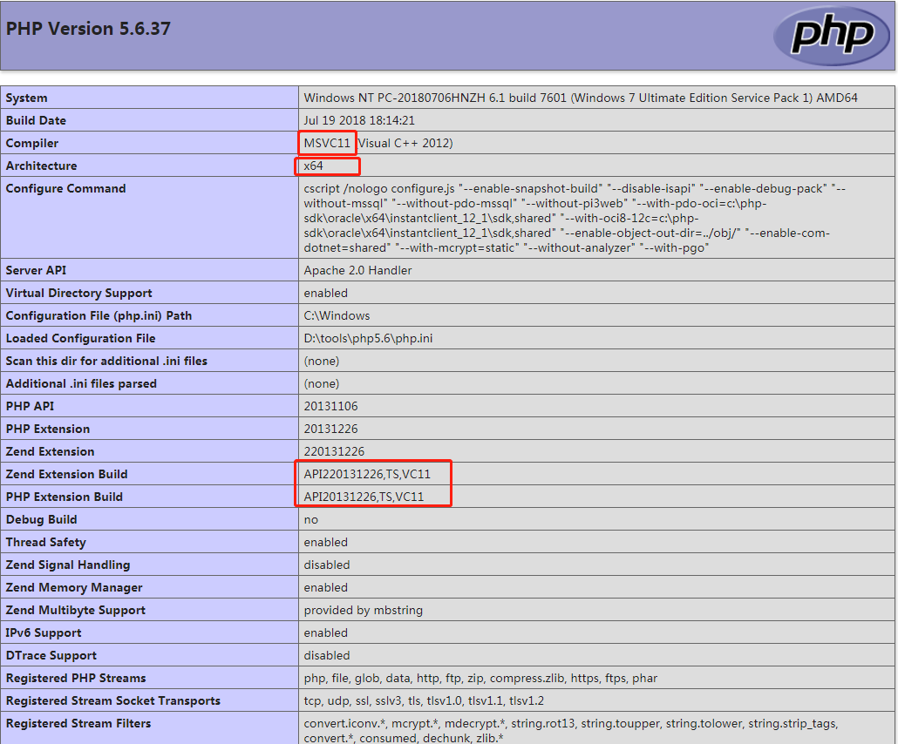

# Laravel-5.1 环境搭建与项目

## 一. 依赖组件

[php 5.6 下载](https://windows.php.net/download#php-5.6)

[apache 2.4 下载](http://httpd.apache.org/download.cgi)

[composer 1.6.5 下载](https://getcomposer.org/download/)

## 二.记录遇到的一些问题

二.记录遇到的一些问题
a. 关于redis插件
1,打开phpinfo页面，查看php版本,根据显示参数下载对应版本

下载对应的第三方包 ：[igbinary](https://windows.php.net/downloads/pecl/releases/igbinary/2.0.1/)&[redis](https://windows.php.net/downloads/pecl/releases/redis/2.2.7/)

放在php- > ext 扩展文件夹中

打开 php.ini 文件添加
````````
; php_redis
extension=php_igbinary.dll
extension=php_redis.dll

b.关于Debug 插件
下载相关插件：xdebug

放在php- > ext 扩展文件夹中

打开 php.ini 文件添加，，，路径因个人而定

[XDebug]
zend_extension = "D:\tools\php5.6\ext\php_xdebug-2.5.5-5.6-vc11-x86_64.dll"
xdebug.profiler_enable = 1
xdebug.profiler_output_dir = "D:\tools\php5.6\tmp" 
xdebug.remote_enable = 1
xdebug.remote_port=9000
xdebug.remote_host = "localhost"